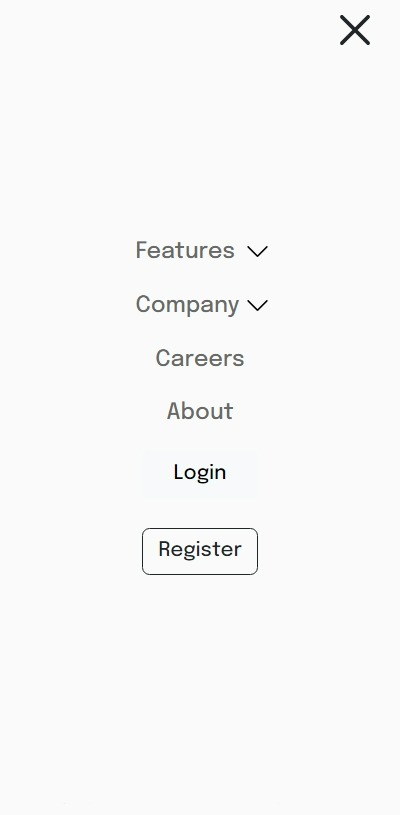
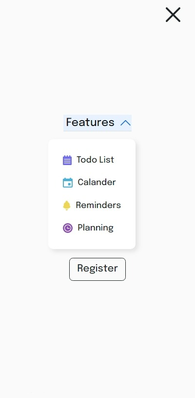

# Frontend Mentor - Intro section with dropdown navigation solution

This is a solution to the [Intro section with dropdown navigation challenge on Frontend Mentor](https://www.frontendmentor.io/challenges/intro-section-with-dropdown-navigation-ryaPetHE5). Frontend Mentor challenges help you improve your coding skills by building realistic projects. 

## Table of contents

- [Overview](#overview)
  - [The challenge](#the-challenge)
  - [Screenshot](#screenshot)
  - [Links](#links)
- [My process](#my-process)
  - [Built with](#built-with)
  - [What I learned](#what-i-learned)
  - [Continued development](#continued-development)
  - [Useful resources](#useful-resources)
- [Author](#author)
- [Acknowledgments](#acknowledgments)


## Overview

### The challenge
This was an amazing learning challenge which taught me lots of new stuffs. Really enjoyed this.

Challenge was that user should be able to:

- View the relevant dropdown menus on desktop and mobile when interacting with the navigation links
- View the optimal layout for the content depending on their device's screen size
- See hover states for all interactive elements on the page
- navigation menu for mobile device
- dropdown list for Features and Company navigation

### Screenshot
Screenshots of how the page looks:





### Links

- Solution URL: [solution code](https://github.com/Gautambudh/Intro-section-with-dropdown-navigation.git)
- Live site URL: [Live page](https://gautambudh.github.io/Intro-section-with-dropdown-navigation/)

## My process

### Built with

- Semantic HTML5 markup
- CSS custom properties
- Bootstrap CSS Grid
- Used Bootstrap for accordion class and dropdown
- Mobile-first workflow
- Javascript for toggling the mobile nav menu

### What I learned

In this project i explored a very cool class **ACCORDION** of Bootstrap5 which come with the dropdown functionality which i used in navigation dropdown list. Also learnt to make hamburger toggling navigation menu for mobile view and how **document.queryselector(.class)** 
works. Got familiar with the **classList.toggle("active")** method in javascript to add and remove a class in an HTML tag.
Also i learnt little bit of animations like ease in and out through CSS to make the nav menu appearance smooth.


A code snippet of how Accordion class of Bootstrap works for creating dropdowns:
```html
<li class="accordion accordion-flush">
    <div class="accordion-item">
        <button class="accordion-button collapsed" type="button" data-bs-toggle="collapse" data-bs-target="#Features" aria-expanded="false" aria-controls="Features">
          <p class="nav-links px-1">Features</p>
        </button>
        <div id="Features" class="accordion-collapse collapse">
          <ul class="accordion-body">
            <li class="d-flex"><p>Todo List</p></li>
            <li class="d-flex"><p>Calander</p></li>
            <li class="d-flex"><p>Reminders</p></li>
            <li class="d-flex"><p>Planning</p></li>
          </ul>
        </div>
    </div>
</li>

```

A code snippet of how i achieve toggling of nav menu in Javascript:
```js
const mobile_nav = document.querySelector(".mobile-nav-btn");
const nav_header = document.querySelector(".header");

// It will add and remove the 'active' class from the Header, 
const toggleNavbar = () => {
    nav_header.classList.toggle("active"); // if active class present, it'll remove it and if not it'll add
}
// Whenever the menu icon btn is clicked, it will call the toggleNavbar() funtion 
mobile_nav.addEventListener("click", () => toggleNavbar());

```

### Continued development

I am further looking to add links for the different navigation pages:

### Useful resources

- [Bootstrap 5](https://getbootstrap.com/) - This helped me for designing the responsive layout for desktop and mobile view. I'd recommend it to anyone still learning this concept.
- [Bootstrap 5 Accordion class](https://getbootstrap.com/docs/5.2/components/accordion/) This helped me in achieving the dropdown feature. Its very cool. Must try.
- [hamburger icon](https://ionic.io/ionicons) - This is an amazing site for adding icons in projects. Must checkout coz it comes with functionality.
- [W3schools](https://www.w3schools.com/) - Another great website for learning all about frontend. I always takes help from this site.

## Author

- Frontend Mentor - [@Gautambudh](https://www.frontendmentor.io/profile/Gautambudh)

## Acknowledgments

Thapa technical is a youtube channel which helped me lot in learning the javascript toggle menu functionality.


